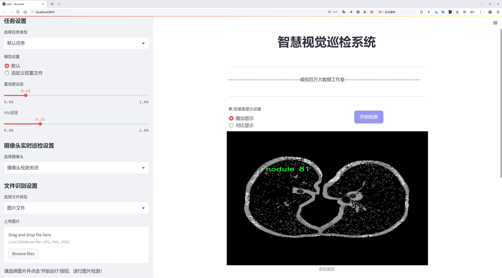
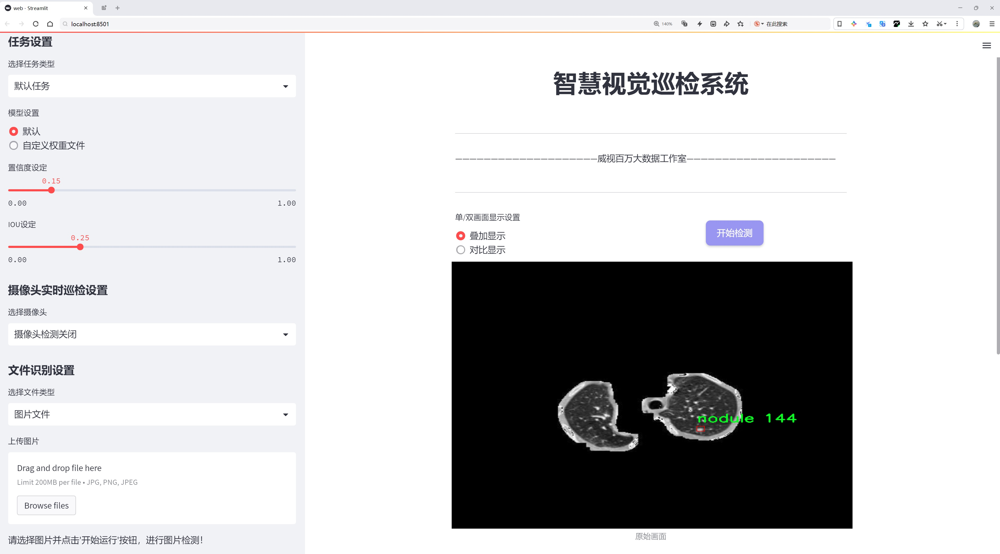
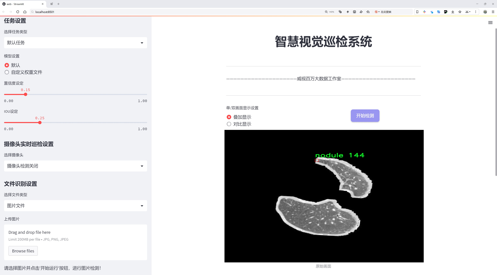
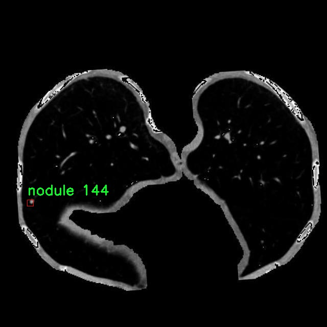
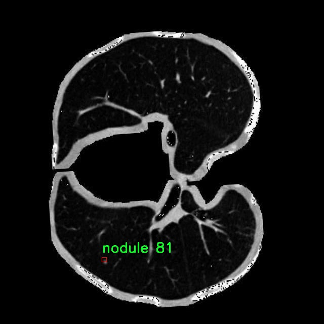
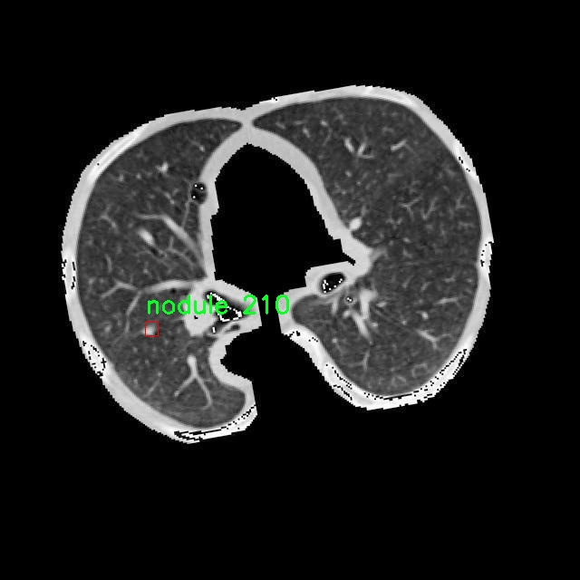
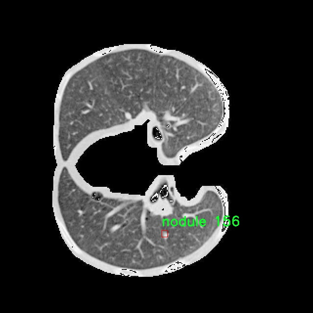

# 肺结节检测检测系统源码分享
 # [一条龙教学YOLOV8标注好的数据集一键训练_70+全套改进创新点发刊_Web前端展示]

### 1.研究背景与意义

项目参考[AAAI Association for the Advancement of Artificial Intelligence](https://gitee.com/qunmasj/projects)

项目来源[AACV Association for the Advancement of Computer Vision](https://kdocs.cn/l/cszuIiCKVNis)

研究背景与意义

肺结节的早期检测在肺癌的预防和治疗中扮演着至关重要的角色。根据世界卫生组织的统计数据，肺癌是全球范围内导致癌症相关死亡的主要原因之一，早期发现和及时干预能够显著提高患者的生存率。随着医学影像技术的不断发展，计算机辅助诊断（CAD）系统逐渐成为肺结节检测的重要工具。近年来，深度学习技术的迅猛发展为医学影像分析提供了新的思路和方法，尤其是目标检测领域的进步，使得基于深度学习的肺结节检测系统得以实现。

YOLO（You Only Look Once）系列模型因其高效的实时检测能力和良好的准确性而受到广泛关注。YOLOv8作为该系列的最新版本，结合了更为先进的网络结构和优化算法，能够在保持高精度的同时显著提高检测速度。然而，尽管YOLOv8在目标检测方面表现出色，但在特定应用场景下，如肺结节检测，仍然存在一些挑战。例如，肺结节的形态、大小和密度差异较大，且常常与周围组织的对比度较低，这使得传统的YOLOv8模型在检测精度上受到限制。因此，基于YOLOv8的改进研究显得尤为重要。

本研究旨在基于改进的YOLOv8模型，构建一个高效的肺结节检测系统。为此，我们将使用包含2800幅医学影像的肺结节数据集进行训练和验证。该数据集专注于单一类别的结节检测，涵盖了多种类型的肺结节，具有较高的代表性和实用性。通过对数据集的深入分析，我们将识别出影响检测性能的关键因素，并在此基础上对YOLOv8模型进行针对性的改进。

本研究的意义不仅在于提高肺结节的检测准确率，还在于推动计算机视觉技术在医学领域的应用。通过优化YOLOv8模型，我们希望能够为临床医生提供一个可靠的辅助诊断工具，从而提高肺癌的早期筛查效率。此外，本研究还将为后续的深度学习模型在其他医学影像分析任务中的应用提供参考和借鉴，推动相关领域的研究进展。

综上所述，基于改进YOLOv8的肺结节检测系统的研究，不仅具有重要的理论价值，也具备广泛的实际应用前景。通过本研究，我们期望能够为肺癌的早期检测提供新的解决方案，助力实现更为精准的个性化医疗。同时，本研究的成果也将为未来的医学影像分析技术的发展奠定基础，推动智能医疗的进步。

### 2.图片演示







##### 注意：由于此博客编辑较早，上面“2.图片演示”和“3.视频演示”展示的系统图片或者视频可能为老版本，新版本在老版本的基础上升级如下：（实际效果以升级的新版本为准）

  （1）适配了YOLOV8的“目标检测”模型和“实例分割”模型，通过加载相应的权重（.pt）文件即可自适应加载模型。

  （2）支持“图片识别”、“视频识别”、“摄像头实时识别”三种识别模式。

  （3）支持“图片识别”、“视频识别”、“摄像头实时识别”三种识别结果保存导出，解决手动导出（容易卡顿出现爆内存）存在的问题，识别完自动保存结果并导出到tempDir中。

  （4）支持Web前端系统中的标题、背景图等自定义修改，后面提供修改教程。

  另外本项目提供训练的数据集和训练教程,暂不提供权重文件（best.pt）,需要您按照教程进行训练后实现图片演示和Web前端界面演示的效果。

### 3.视频演示

[3.1 视频演示](https://www.bilibili.com/video/BV11FtyefE55/)

### 4.数据集信息展示

##### 4.1 本项目数据集详细数据（类别数＆类别名）

nc: 1
names: ['nodule']


##### 4.2 本项目数据集信息介绍

数据集信息展示

在肺结节检测领域，准确性和效率是关键的研究目标。为此，我们构建了一个名为“Nodule-detection”的数据集，旨在为改进YOLOv8模型提供高质量的训练数据。该数据集专注于肺结节的检测，特别是针对医学影像中的结节特征进行深入分析和学习。数据集的设计理念是为研究人员和开发者提供一个统一且标准化的基准，以推动肺结节检测技术的进步。

“Nodule-detection”数据集的类别数量为1，具体类别为“nodule”。这一单一类别的设定，旨在聚焦于肺结节的检测任务，减少其他干扰因素，使模型能够在特定的目标上进行深入学习。肺结节作为一种常见的肺部病变，其早期发现和准确诊断对于提高患者的生存率至关重要。因此，数据集中的每一幅图像都经过精心挑选和标注，确保其在训练过程中能够提供丰富的特征信息。

在数据集的构建过程中，我们收集了来自多种来源的医学影像，包括CT扫描和X光片。这些影像不仅涵盖了不同类型的肺结节，还包含了不同的影像质量和拍摄角度，旨在增强模型的泛化能力。每幅图像都经过专业放射科医生的审核和标注，确保结节的位置、大小和形态等信息的准确性。这种高质量的标注为模型的训练提供了坚实的基础，使其能够有效地学习到肺结节的多样性和复杂性。

此外，为了提升数据集的实用性，我们还对图像进行了多种数据增强处理，包括旋转、缩放、翻转和亮度调整等。这些增强技术不仅增加了数据集的样本数量，还提高了模型在不同条件下的鲁棒性，使其能够在实际应用中更好地应对各种变化和干扰。通过这种方式，我们希望能够培养出一个在多种临床场景下均能表现出色的肺结节检测系统。

在模型训练阶段，利用“Nodule-detection”数据集，我们将YOLOv8的检测能力与深度学习的最新进展相结合，力求实现更高的检测精度和更快的推理速度。YOLOv8作为一种先进的目标检测模型，其在处理复杂图像时的效率和准确性，使其成为肺结节检测的理想选择。通过对数据集的不断优化和扩展，我们期望能够推动这一领域的研究进展，为临床诊断提供更为强大的技术支持。

总之，“Nodule-detection”数据集不仅是一个简单的图像集合，更是一个为肺结节检测技术的进步而精心设计的资源。通过对数据集的深入研究和应用，我们相信能够为肺结节的早期检测和诊断提供重要的支持，最终为患者的健康保驾护航。










### 5.全套项目环境部署视频教程（零基础手把手教学）

[5.1 环境部署教程链接（零基础手把手教学）](https://www.ixigua.com/7404473917358506534?logTag=c807d0cbc21c0ef59de5)


[5.2 安装Python虚拟环境创建和依赖库安装视频教程链接（零基础手把手教学）](https://www.ixigua.com/7404474678003106304?logTag=1f1041108cd1f708b01a)

### 6.手把手YOLOV8训练视频教程（零基础小白有手就能学会）

[6.1 手把手YOLOV8训练视频教程（零基础小白有手就能学会）](https://www.ixigua.com/7404477157818401292?logTag=d31a2dfd1983c9668658)

### 7.70+种全套YOLOV8创新点代码加载调参视频教程（一键加载写好的改进模型的配置文件）

[7.1 70+种全套YOLOV8创新点代码加载调参视频教程（一键加载写好的改进模型的配置文件）](https://www.ixigua.com/7404478314661806627?logTag=29066f8288e3f4eea3a4)

### 8.70+种全套YOLOV8创新点原理讲解（非科班也可以轻松写刊发刊，V10版本正在科研待更新）

由于篇幅限制，每个创新点的具体原理讲解就不一一展开，具体见下列网址中的创新点对应子项目的技术原理博客网址【Blog】：


[8.1 70+种全套YOLOV8创新点原理讲解链接](https://gitee.com/qunmasj/good)

### 9.系统功能展示（检测对象为举例，实际内容以本项目数据集为准）

图9.1.系统支持检测结果表格显示

  图9.2.系统支持置信度和IOU阈值手动调节

  图9.3.系统支持自定义加载权重文件best.pt(需要你通过步骤5中训练获得)

  图9.4.系统支持摄像头实时识别

  图9.5.系统支持图片识别

  图9.6.系统支持视频识别

  图9.7.系统支持识别结果文件自动保存

  图9.8.系统支持Excel导出检测结果数据


### 10.原始YOLOV8算法原理

原始YOLOv8算法原理

YOLOv8模型是由Ultralytics团队在YOLOv5的基础上进行改进和优化的最新目标检测算法，于2023年1月正式提出。作为YOLO系列的又一重要进展，YOLOv8吸收了近两年半内在实际应用中验证的多项技术创新，力求在目标检测的精度和速度上达到新的高度。与之前的YOLO系列模型相似，YOLOv8也提供了多种尺寸的模型选择，以适应不同的应用场景和计算资源限制。

在YOLOv8的网络结构中，输入层负责接收经过预处理的图像数据。值得注意的是，YOLOv8在数据增强策略上进行了重要调整。尽管Mosaic数据增强技术在提升模型鲁棒性和泛化能力方面表现出色，但在训练的最后10个epoch中，YOLOv8选择停止使用Mosaic，以避免破坏数据的真实分布，从而使模型能够更好地学习有效信息。

YOLOv8的主干网络结构相较于YOLOv5并没有进行大幅度的改动，主要的变化体现在C3模块被C2f模块所替代。C2f模块的设计灵感来源于YOLOv7中的ELAN结构，增加了更多的跳层连接，旨在增强梯度流的丰富性。这种设计不仅有助于缓解深层网络中的梯度消失问题，还确保了模型的轻量化。与此同时，YOLOv8保留了SPPF模块，以在保持效果的同时减少执行时间。

在颈部网络（Neck）部分，YOLOv8同样将所有的C3模块替换为C2f模块，并删除了两处上采样之前的卷积连接层。这一系列改动使得特征融合的效率得到了显著提升。YOLOv8采用了PAN-FPN结构，这种结构能够有效地进行多尺度特征的融合，确保不同层次的特征能够被充分利用，从而提升检测精度。

在头部网络（Head）中，YOLOv8借鉴了YOLOX的解耦头设计，采用了两条并行的分支，分别负责提取类别和位置特征。这种设计理念源于分类任务和定位任务在特征提取上的侧重点不同，分类任务更关注特征图中提取到的特征与已有类别的相似性，而定位任务则更关注边界框与真实框之间的位置关系。通过使用两个独立的检测头，YOLOv8在收敛速度和预测精度上均有显著提升。

YOLOv8的另一个重要创新是采用了无锚框结构，这一结构使得模型能够直接预测目标的中心位置。为了解决正负样本的区分问题，YOLOv8引入了任务对齐学习（Task Alignment Learning，TAL），并将分类分数与IOU的高次幂乘积作为衡量任务对齐程度的指标。这一方法不仅提高了分类和定位的准确性，还使得损失函数的设计更加合理，能够更好地反映模型在不同任务上的表现。

在损失函数的设计上，YOLOv8采用了VFLLoss作为分类损失，DFLLoss和CIoULoss则用于定位损失的计算。这种多样化的损失函数设计使得模型在训练过程中能够更好地平衡分类和定位的任务，从而提高整体性能。

YOLOv8在检测结果上也取得了显著的成就。在COCO数据集上的实验表明，YOLOv8在相同尺寸的模型中，参数数量没有显著增加的情况下，精度却优于其他模型。此外，YOLOv8在推理速度上也表现出色，能够在保证精度的前提下实现更快的检测速度。这些优势使得YOLOv8在实时性和准确性之间达到了良好的平衡，特别适合于需要快速响应的应用场景，如机器人垃圾分拣系统等。

综上所述，YOLOv8模型通过对主干网络、颈部网络和头部网络的多项创新和优化，提升了目标检测的精度和速度。其在数据增强策略、特征提取、损失函数设计等方面的改进，使得YOLOv8不仅在理论上具有重要的研究价值，也在实际应用中展现出广泛的应用潜力。随着YOLOv8的不断发展和完善，未来在目标检测领域的应用前景将更加广阔。


### 11.项目核心源码讲解（再也不用担心看不懂代码逻辑）

#### 11.1 code\ultralytics\models\rtdetr\val.py

以下是经过精简和注释的核心代码部分，保留了最重要的功能和结构：

```python
import torch
from ultralytics.data import YOLODataset
from ultralytics.models.yolo.detect import DetectionValidator
from ultralytics.utils import ops

class RTDETRDataset(YOLODataset):
    """
    RT-DETR 数据集类，继承自 YOLODataset。
    该类专为 RT-DETR 目标检测模型设计，优化了实时检测和跟踪任务。
    """

    def __init__(self, *args, data=None, **kwargs):
        """初始化 RTDETRDataset 类，调用父类构造函数。"""
        super().__init__(*args, data=data, **kwargs)

    def load_image(self, i, rect_mode=False):
        """加载数据集中索引为 'i' 的一张图片，返回 (im, resized hw)。"""
        return super().load_image(i=i, rect_mode=rect_mode)

    def build_transforms(self, hyp=None):
        """构建数据预处理变换，仅用于评估阶段。"""
        transforms = []
        if self.augment:
            # 根据是否进行增强来设置变换
            transforms = v8_transforms(self, self.imgsz, hyp, stretch=True)
        transforms.append(
            # 格式化变换，设置边界框格式和归一化
            Format(
                bbox_format="xywh",
                normalize=True,
                return_mask=self.use_segments,
                return_keypoint=self.use_keypoints,
                batch_idx=True,
                mask_ratio=hyp.mask_ratio,
                mask_overlap=hyp.overlap_mask,
            )
        )
        return transforms


class RTDETRValidator(DetectionValidator):
    """
    RTDETRValidator 类扩展了 DetectionValidator，提供专门针对 RT-DETR 模型的验证功能。
    该类构建 RTDETR 特定的数据集进行验证，并应用非极大值抑制进行后处理。
    """

    def build_dataset(self, img_path, mode="val", batch=None):
        """
        构建 RTDETR 数据集。

        Args:
            img_path (str): 包含图片的文件夹路径。
            mode (str): 模式，`train` 或 `val`，可自定义不同的增强。
            batch (int, optional): 批大小，仅用于 `rect` 模式。
        """
        return RTDETRDataset(
            img_path=img_path,
            imgsz=self.args.imgsz,
            batch_size=batch,
            augment=False,  # 不进行增强
            hyp=self.args,
            rect=False,  # 不使用矩形模式
            cache=self.args.cache or None,
            data=self.data,
        )

    def postprocess(self, preds):
        """对预测输出应用非极大值抑制。"""
        bs, _, nd = preds[0].shape
        bboxes, scores = preds[0].split((4, nd - 4), dim=-1)  # 分离边界框和分数
        bboxes *= self.args.imgsz  # 缩放边界框
        outputs = [torch.zeros((0, 6), device=bboxes.device)] * bs  # 初始化输出
        for i, bbox in enumerate(bboxes):
            bbox = ops.xywh2xyxy(bbox)  # 转换为 xyxy 格式
            score, cls = scores[i].max(-1)  # 获取最大分数和对应类别
            pred = torch.cat([bbox, score[..., None], cls[..., None]], dim=-1)  # 合并边界框、分数和类别
            pred = pred[score.argsort(descending=True)]  # 按分数排序
            outputs[i] = pred  # 保存预测结果

        return outputs

    def _prepare_batch(self, si, batch):
        """准备训练或推理的批次，应用变换。"""
        idx = batch["batch_idx"] == si
        cls = batch["cls"][idx].squeeze(-1)
        bbox = batch["bboxes"][idx]
        ori_shape = batch["ori_shape"][si]
        imgsz = batch["img"].shape[2:]
        if len(cls):
            bbox = ops.xywh2xyxy(bbox)  # 转换目标框格式
            bbox[..., [0, 2]] *= ori_shape[1]  # 转换为原始空间
            bbox[..., [1, 3]] *= ori_shape[0]  # 转换为原始空间
        return dict(cls=cls, bbox=bbox, ori_shape=ori_shape, imgsz=imgsz)

    def _prepare_pred(self, pred, pbatch):
        """准备并返回转换后的边界框和类别标签的批次。"""
        predn = pred.clone()
        predn[..., [0, 2]] *= pbatch["ori_shape"][1] / self.args.imgsz  # 转换为原始空间
        predn[..., [1, 3]] *= pbatch["ori_shape"][0] / self.args.imgsz  # 转换为原始空间
        return predn.float()
```

### 代码分析
1. **RTDETRDataset 类**:
   - 继承自 `YOLODataset`，用于处理 RT-DETR 模型的数据集。
   - `load_image` 方法用于加载图像，`build_transforms` 方法用于构建数据预处理的变换。

2. **RTDETRValidator 类**:
   - 继承自 `DetectionValidator`，提供 RT-DETR 模型的验证功能。
   - `build_dataset` 方法用于构建数据集，`postprocess` 方法用于处理预测结果，应用非极大值抑制。
   - `_prepare_batch` 和 `_prepare_pred` 方法用于准备训练和推理的批次数据。

这些核心部分实现了 RT-DETR 模型的基本数据处理和验证功能，确保模型能够有效地进行目标检测和跟踪。

这个文件是一个用于RT-DETR（实时目标检测与跟踪）模型验证的Python脚本，主要包含两个类：`RTDETRDataset`和`RTDETRValidator`。首先，`RTDETRDataset`类继承自`YOLODataset`，用于构建适合RT-DETR模型的数据集。该类的构造函数调用了父类的构造函数，并重写了`load_image`方法，以便加载图像并返回其大小。`build_transforms`方法用于构建数据增强的转换，主要用于评估阶段。根据是否启用增强，它会选择不同的转换方式，并返回一个包含格式化选项的转换列表。

接下来是`RTDETRValidator`类，它继承自`DetectionValidator`，提供了专门针对RT-DETR模型的验证功能。该类的`build_dataset`方法用于构建RT-DETR数据集，接受图像路径、模式（训练或验证）和批次大小作为参数。它返回一个`RTDETRDataset`实例，设置了相关参数，如图像大小、批次大小等。

`postprocess`方法应用非极大值抑制（NMS）来处理预测输出，确保只保留最优的边界框。它首先将预测的边界框和分数分开，然后将边界框缩放到原始图像大小，并根据分数进行排序，最终返回处理后的输出。

此外，`_prepare_batch`和`_prepare_pred`方法分别用于准备输入批次和处理预测结果。`_prepare_batch`方法从批次中提取类标签、边界框和其他信息，并将边界框转换为原始空间的坐标。`_prepare_pred`方法则对预测结果进行处理，确保边界框的坐标与原始图像的大小相匹配。

总体而言，这个文件的主要功能是为RT-DETR模型提供数据集构建和验证的支持，确保模型在实时目标检测和跟踪任务中的有效性。

#### 11.2 code\ultralytics\models\yolo\detect\__init__.py

```python
# 导入必要的模块
# DetectionPredictor: 用于目标检测的预测类
# DetectionTrainer: 用于训练目标检测模型的类
# DetectionValidator: 用于验证目标检测模型性能的类
from .predict import DetectionPredictor
from .train import DetectionTrainer
from .val import DetectionValidator

# 定义模块的公开接口
# __all__ 变量用于指定当使用 'from module import *' 时，哪些类或函数会被导入
__all__ = "DetectionPredictor", "DetectionTrainer", "DetectionValidator"
``` 

### 代码核心部分说明：
1. **模块导入**：通过 `from .predict import DetectionPredictor` 等语句导入了三个核心类，这些类分别负责目标检测的预测、训练和验证。
2. **公开接口定义**：`__all__` 变量定义了模块的公共接口，确保在使用 `from module import *` 时只导入指定的类，避免导入不必要的内容，保持模块的整洁性和可维护性。

这个程序文件是Ultralytics YOLO（You Only Look Once）项目的一部分，主要用于目标检测。文件的第一行是一个注释，表明该项目使用的是AGPL-3.0许可证，并且标识了这是Ultralytics YOLO的代码。

接下来的几行代码是从当前包中导入了三个类：`DetectionPredictor`、`DetectionTrainer`和`DetectionValidator`。这些类分别用于目标检测的不同阶段：预测、训练和验证。通过导入这些类，用户可以在其他模块中使用它们，而不需要直接引用具体的文件路径。

最后，`__all__`变量定义了一个字符串元组，列出了可以被外部导入的类名。这意味着，当使用`from . import *`语句时，只会导入`DetectionPredictor`、`DetectionTrainer`和`DetectionValidator`这三个类。这种做法有助于控制模块的公共接口，避免不必要的名称冲突或误用。

总的来说，这个文件的主要功能是组织和导出与YOLO目标检测相关的主要功能模块，使得用户可以方便地使用这些功能。

#### 11.3 ui.py

```python
import sys
import subprocess

def run_script(script_path):
    """
    使用当前 Python 环境运行指定的脚本。

    Args:
        script_path (str): 要运行的脚本路径

    Returns:
        None
    """
    # 获取当前 Python 解释器的路径
    python_path = sys.executable

    # 构建运行命令，使用 streamlit 运行指定的脚本
    command = f'"{python_path}" -m streamlit run "{script_path}"'

    # 执行命令并等待其完成
    result = subprocess.run(command, shell=True)
    
    # 检查命令执行的返回码，如果不为0则表示出错
    if result.returncode != 0:
        print("脚本运行出错。")


# 主程序入口
if __name__ == "__main__":
    # 指定要运行的脚本路径
    script_path = "web.py"  # 这里可以替换为实际的脚本路径

    # 调用函数运行脚本
    run_script(script_path)
```

### 代码注释说明：
1. **导入模块**：
   - `sys`：用于获取当前 Python 解释器的路径。
   - `subprocess`：用于执行外部命令。

2. **`run_script` 函数**：
   - 功能：使用当前 Python 环境运行指定的脚本。
   - 参数：`script_path`，表示要运行的脚本的路径。
   - 实现步骤：
     - 获取当前 Python 解释器的路径，存储在 `python_path` 变量中。
     - 构建运行命令，使用 `streamlit` 模块运行指定的脚本。
     - 使用 `subprocess.run` 执行命令，并等待其完成。
     - 检查命令的返回码，如果返回码不为0，表示脚本运行出错，打印错误信息。

3. **主程序入口**：
   - 使用 `if __name__ == "__main__":` 确保只有在直接运行该脚本时才会执行以下代码。
   - 指定要运行的脚本路径为 `web.py`。
   - 调用 `run_script` 函数来执行指定的脚本。

这个程序文件名为 `ui.py`，主要功能是使用当前的 Python 环境来运行一个指定的脚本。程序的第一部分导入了必要的模块，包括 `sys`、`os` 和 `subprocess`，以及一个自定义的路径处理模块 `abs_path`。

在 `run_script` 函数中，首先获取当前 Python 解释器的路径，这通过 `sys.executable` 实现。接着，构建一个命令字符串，该命令用于调用 `streamlit` 运行指定的脚本。这里使用了 `-m` 参数来指定模块运行的方式，并且通过 `shell=True` 选项来在 shell 中执行这个命令。

在执行命令后，程序会检查返回的状态码。如果返回码不为零，表示脚本运行出错，程序会输出一条错误信息。

在文件的最后部分，使用 `if __name__ == "__main__":` 来确保只有在直接运行该脚本时才会执行以下代码。这里指定了要运行的脚本路径为 `web.py`，并调用 `run_script` 函数来执行这个脚本。

总体来说，这个程序的主要作用是封装了一个运行指定 Python 脚本的功能，方便用户通过 `ui.py` 来启动 `web.py` 脚本。

#### 11.4 70+种YOLOv8算法改进源码大全和调试加载训练教程（非必要）\ultralytics\models\utils\ops.py

以下是经过简化和注释的核心代码部分，主要保留了 `HungarianMatcher` 类及其核心方法 `forward`，并对每个步骤进行了详细的中文注释。

```python
import torch
import torch.nn as nn
import torch.nn.functional as F
from scipy.optimize import linear_sum_assignment
from ultralytics.utils.metrics import bbox_iou

class HungarianMatcher(nn.Module):
    """
    实现匈牙利匹配器的模块，用于在预测和真实边界框之间进行最优匹配。
    """

    def __init__(self, cost_gain=None, use_fl=True):
        """初始化 HungarianMatcher，设置成本系数和损失计算方式。"""
        super().__init__()
        if cost_gain is None:
            cost_gain = {'class': 1, 'bbox': 5, 'giou': 2}
        self.cost_gain = cost_gain  # 成本系数
        self.use_fl = use_fl  # 是否使用焦点损失

    def forward(self, pred_bboxes, pred_scores, gt_bboxes, gt_cls, gt_groups):
        """
        前向传播，计算预测与真实值之间的匹配。

        Args:
            pred_bboxes (Tensor): 预测的边界框，形状为 [batch_size, num_queries, 4]。
            pred_scores (Tensor): 预测的分数，形状为 [batch_size, num_queries, num_classes]。
            gt_bboxes (Tensor): 真实的边界框，形状为 [num_gts, 4]。
            gt_cls (Tensor): 真实的类别，形状为 [num_gts, ]。
            gt_groups (List[int]): 每个图像的真实框数量。

        Returns:
            List[Tuple[Tensor, Tensor]]: 每个批次的匹配索引。
        """
        bs, nq, nc = pred_scores.shape  # 获取批次大小、查询数量和类别数量

        # 如果没有真实框，返回空匹配
        if sum(gt_groups) == 0:
            return [(torch.tensor([], dtype=torch.long), torch.tensor([], dtype=torch.long)) for _ in range(bs)]

        # 将预测分数展平以计算成本矩阵
        pred_scores = pred_scores.detach().view(-1, nc)
        pred_scores = F.sigmoid(pred_scores) if self.use_fl else F.softmax(pred_scores, dim=-1)
        pred_bboxes = pred_bboxes.detach().view(-1, 4)

        # 计算分类成本
        pred_scores = pred_scores[:, gt_cls]  # 仅保留真实类别的分数
        cost_class = -pred_scores  # 分类成本为负分数

        # 计算边界框之间的L1成本
        cost_bbox = (pred_bboxes.unsqueeze(1) - gt_bboxes.unsqueeze(0)).abs().sum(-1)  # 计算L1距离

        # 计算GIoU成本
        cost_giou = 1.0 - bbox_iou(pred_bboxes.unsqueeze(1), gt_bboxes.unsqueeze(0), xywh=True, GIoU=True).squeeze(-1)

        # 最终成本矩阵
        C = self.cost_gain['class'] * cost_class + \
            self.cost_gain['bbox'] * cost_bbox + \
            self.cost_gain['giou'] * cost_giou

        # 将无效值（NaN和无穷大）设置为0
        C[C.isnan() | C.isinf()] = 0.0

        C = C.view(bs, nq, -1).cpu()  # 将成本矩阵重塑为 [batch_size, num_queries, num_gt]
        indices = [linear_sum_assignment(c[i]) for i, c in enumerate(C.split(gt_groups, -1))]  # 进行匈牙利匹配
        gt_groups = torch.as_tensor([0, *gt_groups[:-1]]).cumsum_(0)  # 计算真实框的累积和

        # 返回每个批次的匹配索引
        return [(torch.tensor(i, dtype=torch.long), torch.tensor(j, dtype=torch.long) + gt_groups[k])
                for k, (i, j) in enumerate(indices)]
```

### 代码说明：
1. **HungarianMatcher 类**：实现了匈牙利算法，用于在预测和真实边界框之间进行最优匹配。
2. **__init__ 方法**：初始化成本系数和损失计算方式。
3. **forward 方法**：
   - 输入预测的边界框、分数、真实边界框和类别。
   - 计算分类成本、L1成本和GIoU成本。
   - 构建最终的成本矩阵，并使用匈牙利算法进行匹配。
   - 返回每个批次的匹配索引。

这个程序文件是一个实现了匈牙利匹配算法的模块，主要用于目标检测任务中的预测框与真实框之间的最优匹配。该模块的核心是`HungarianMatcher`类，它通过计算分类成本、边界框成本和GIoU（广义交并比）成本来实现这一目标。匈牙利算法是一种解决分配问题的有效方法，能够在给定的成本矩阵中找到最小成本的匹配。

在`HungarianMatcher`类的构造函数中，初始化了一些成本系数、是否使用Focal Loss、是否进行掩码预测、样本点数量以及Focal Loss的超参数（alpha和gamma）。这些参数用于在匹配过程中调整不同成本的权重。

`forward`方法是该类的主要功能实现，它接收预测的边界框、分类分数、真实边界框、真实类别等信息，并计算出一个成本矩阵。首先，它将预测的分数进行处理（使用sigmoid或softmax），然后计算分类成本、L1成本和GIoU成本。最终，结合各项成本和对应的权重，形成一个综合成本矩阵，并使用匈牙利算法找到最佳匹配的索引。

此外，文件中还定义了一个`get_cdn_group`函数，用于生成对比去噪训练组。该函数从真实框中创建正负样本，并对类别标签和边界框坐标施加噪声。函数返回修改后的类别嵌入、边界框、注意力掩码和元信息，适用于训练过程中的对比去噪任务。

总的来说，这个文件的主要功能是通过匈牙利算法实现目标检测中的预测与真实框的匹配，同时支持对掩码的处理和对比去噪训练，为YOLOv8算法的改进提供了基础。

#### 11.5 train.py

以下是经过简化和注释的核心代码部分：

```python
import random
import numpy as np
import torch.nn as nn
from ultralytics.data import build_dataloader, build_yolo_dataset
from ultralytics.engine.trainer import BaseTrainer
from ultralytics.models import yolo
from ultralytics.nn.tasks import DetectionModel
from ultralytics.utils import LOGGER, RANK
from ultralytics.utils.torch_utils import de_parallel, torch_distributed_zero_first

class DetectionTrainer(BaseTrainer):
    """
    扩展自 BaseTrainer 类，用于基于检测模型的训练。
    """

    def build_dataset(self, img_path, mode="train", batch=None):
        """
        构建 YOLO 数据集。

        参数:
            img_path (str): 包含图像的文件夹路径。
            mode (str): 模式，可以是 `train` 或 `val`，用户可以为每种模式自定义不同的增强。
            batch (int, optional): 批次大小，仅用于 `rect` 模式。默认为 None。
        """
        gs = max(int(de_parallel(self.model).stride.max() if self.model else 0), 32)  # 获取模型的最大步幅
        return build_yolo_dataset(self.args, img_path, batch, self.data, mode=mode, rect=mode == "val", stride=gs)

    def get_dataloader(self, dataset_path, batch_size=16, rank=0, mode="train"):
        """构造并返回数据加载器。"""
        assert mode in ["train", "val"]  # 确保模式有效
        with torch_distributed_zero_first(rank):  # 仅在 DDP 时初始化数据集 *.cache 一次
            dataset = self.build_dataset(dataset_path, mode, batch_size)  # 构建数据集
        shuffle = mode == "train"  # 训练模式下打乱数据
        workers = self.args.workers if mode == "train" else self.args.workers * 2  # 设置工作线程数
        return build_dataloader(dataset, batch_size, workers, shuffle, rank)  # 返回数据加载器

    def preprocess_batch(self, batch):
        """对图像批次进行预处理，包括缩放和转换为浮点数。"""
        batch["img"] = batch["img"].to(self.device, non_blocking=True).float() / 255  # 转换为浮点数并归一化
        if self.args.multi_scale:  # 如果启用多尺度
            imgs = batch["img"]
            sz = (
                random.randrange(self.args.imgsz * 0.5, self.args.imgsz * 1.5 + self.stride)
                // self.stride
                * self.stride
            )  # 随机选择尺寸
            sf = sz / max(imgs.shape[2:])  # 计算缩放因子
            if sf != 1:  # 如果需要缩放
                ns = [
                    math.ceil(x * sf / self.stride) * self.stride for x in imgs.shape[2:]
                ]  # 计算新的形状
                imgs = nn.functional.interpolate(imgs, size=ns, mode="bilinear", align_corners=False)  # 进行插值
            batch["img"] = imgs  # 更新批次图像
        return batch

    def set_model_attributes(self):
        """设置模型的属性，包括类别数量和名称。"""
        self.model.nc = self.data["nc"]  # 将类别数量附加到模型
        self.model.names = self.data["names"]  # 将类别名称附加到模型
        self.model.args = self.args  # 将超参数附加到模型

    def get_model(self, cfg=None, weights=None, verbose=True):
        """返回 YOLO 检测模型。"""
        model = DetectionModel(cfg, nc=self.data["nc"], verbose=verbose and RANK == -1)  # 创建检测模型
        if weights:
            model.load(weights)  # 加载权重
        return model

    def plot_training_samples(self, batch, ni):
        """绘制带有注释的训练样本。"""
        plot_images(
            images=batch["img"],
            batch_idx=batch["batch_idx"],
            cls=batch["cls"].squeeze(-1),
            bboxes=batch["bboxes"],
            paths=batch["im_file"],
            fname=self.save_dir / f"train_batch{ni}.jpg",
            on_plot=self.on_plot,
        )

    def plot_metrics(self):
        """从 CSV 文件绘制指标。"""
        plot_results(file=self.csv, on_plot=self.on_plot)  # 保存结果图
```

### 代码注释说明：
1. **类和方法定义**：`DetectionTrainer` 类继承自 `BaseTrainer`，用于训练 YOLO 检测模型。
2. **数据集构建**：`build_dataset` 方法根据输入路径和模式构建数据集，并处理不同的增强。
3. **数据加载器**：`get_dataloader` 方法构造数据加载器，支持分布式训练。
4. **批次预处理**：`preprocess_batch` 方法对输入图像进行归一化和可选的多尺度处理。
5. **模型属性设置**：`set_model_attributes` 方法将类别数量和名称附加到模型。
6. **模型获取**：`get_model` 方法返回一个 YOLO 检测模型，并可选择加载预训练权重。
7. **绘图功能**：`plot_training_samples` 和 `plot_metrics` 方法用于可视化训练样本和训练指标。

这个程序文件 `train.py` 是一个用于训练 YOLO（You Only Look Once）目标检测模型的脚本，基于 Ultralytics 的实现。文件中定义了一个名为 `DetectionTrainer` 的类，该类继承自 `BaseTrainer`，并提供了一系列方法来构建数据集、获取数据加载器、预处理图像、设置模型属性、获取模型、进行验证、记录损失、显示训练进度、绘制训练样本和绘制指标等功能。

在 `DetectionTrainer` 类中，`build_dataset` 方法用于构建 YOLO 数据集，接收图像路径、模式（训练或验证）和批次大小作为参数。它会根据模型的步幅来决定图像的处理方式，并调用 `build_yolo_dataset` 函数来实际构建数据集。

`get_dataloader` 方法用于创建并返回数据加载器，确保在分布式训练中只初始化一次数据集。该方法根据模式决定是否打乱数据，并设置工作线程的数量。

`preprocess_batch` 方法对输入的图像批次进行预处理，包括将图像缩放到适当的大小并转换为浮点数格式。该方法还支持多尺度训练，随机选择图像大小进行训练，以增强模型的鲁棒性。

`set_model_attributes` 方法用于设置模型的属性，包括类别数量和类别名称等，以确保模型能够正确处理数据集中的目标。

`get_model` 方法用于返回一个 YOLO 检测模型，可以选择加载预训练权重。

`get_validator` 方法返回一个用于模型验证的 `DetectionValidator` 实例，能够计算损失并评估模型性能。

`label_loss_items` 方法用于返回带有标签的训练损失项字典，便于记录和分析训练过程中的损失情况。

`progress_string` 方法返回一个格式化的字符串，显示训练进度，包括当前的轮次、GPU 内存使用情况、损失值、实例数量和图像大小等信息。

`plot_training_samples` 方法用于绘制训练样本及其标注，帮助可视化训练数据的质量。

最后，`plot_metrics` 和 `plot_training_labels` 方法分别用于绘制训练过程中的指标和生成带标签的训练图，以便于分析模型的训练效果。

整体而言，这个文件提供了一个结构化的框架，用于训练 YOLO 模型，支持多种功能以增强训练过程的可视化和分析能力。

#### 11.6 code\ultralytics\models\yolo\__init__.py

以下是代码中最核心的部分，并附上详细的中文注释：

```python
# 导入Ultralytics YOLO模型的不同功能模块
from ultralytics.models.yolo import classify, detect, obb, pose, segment

# 从当前模块导入YOLO类
from .model import YOLO

# 定义模块的公开接口，允许外部访问这些功能
__all__ = "classify", "segment", "detect", "pose", "obb", "YOLO"
```

### 代码注释说明：

1. **导入功能模块**：
   - `from ultralytics.models.yolo import classify, detect, obb, pose, segment`：这一行代码从`ultralytics`库中导入了YOLO模型的多个功能模块，包括分类（classify）、检测（detect）、方向边界框（obb）、姿态估计（pose）和分割（segment）。这些模块提供了不同的计算机视觉任务的实现。

2. **导入YOLO类**：
   - `from .model import YOLO`：这一行代码从当前目录下的`model`模块中导入了`YOLO`类。这个类通常用于创建YOLO模型的实例，以便进行训练或推理。

3. **定义公开接口**：
   - `__all__ = "classify", "segment", "detect", "pose", "obb", "YOLO"`：这一行代码定义了模块的公开接口。`__all__`是一个特殊变量，包含了一个字符串列表，列出了可以被外部导入的名称。这意味着当使用`from module import *`时，只会导入这些指定的名称，从而控制模块的可见性。

这个程序文件是Ultralytics YOLO模型库的初始化文件，文件名为`__init__.py`，它的主要作用是定义该模块的公共接口。首先，文件顶部有一行注释，表明这是Ultralytics YOLO项目的一部分，并且该项目遵循AGPL-3.0许可证。

接下来，文件通过`from`语句导入了多个功能模块，包括`classify`（分类）、`detect`（检测）、`obb`（倾斜边界框）、`pose`（姿态估计）和`segment`（分割）。这些模块提供了YOLO模型的不同功能，允许用户在图像或视频中进行目标检测、分类、姿态估计等操作。

此外，文件还从同一目录下的`model`模块中导入了`YOLO`类，这个类可能是YOLO模型的核心实现，负责模型的构建和推理。

最后，`__all__`变量被定义为一个元组，包含了所有希望公开的模块和类的名称。这意味着当用户使用`from ultralytics.models.yolo import *`这样的语句时，只会导入`classify`、`segment`、`detect`、`pose`、`obb`和`YOLO`，而不会导入其他未列出的内容。这种做法有助于控制模块的公共接口，避免不必要的命名冲突和隐藏实现细节。

### 12.系统整体结构（节选）

### 整体功能和构架概括

该项目是一个基于YOLO（You Only Look Once）目标检测框架的实现，主要用于实时目标检测和相关任务。项目的架构由多个模块组成，每个模块负责特定的功能，如模型训练、验证、推理、数据处理和可视化等。整体上，项目通过不同的类和函数实现了从数据加载、模型训练到结果评估的完整流程，支持多种目标检测和计算机视觉任务。

以下是项目中各个文件的功能整理表：

| 文件路径 | 功能描述 |
|----------|----------|
| `code\ultralytics\models\rtdetr\val.py` | 实现RT-DETR模型的验证功能，包括数据集构建、预测处理和结果评估。 |
| `code\ultralytics\models\yolo\detect\__init__.py` | 导入YOLO模型的主要功能模块，提供公共接口以便于用户使用。 |
| `ui.py` | 封装了一个运行指定Python脚本的功能，主要用于启动`web.py`脚本。 |
| `code\ultralytics\utils\tal.py` | 提供了一些实用工具函数，可能用于训练过程中的数据处理或其他辅助功能。 |
| `code\ultralytics\models\utils\ops.py` | 实现匈牙利匹配算法，用于目标检测中的预测框与真实框的最优匹配，支持对掩码的处理和对比去噪训练。 |
| `train.py` | 定义了`DetectionTrainer`类，负责YOLO模型的训练过程，包括数据集构建、模型设置、损失记录和训练进度可视化等功能。 |
| `code\ultralytics\models\yolo\__init__.py` | 初始化YOLO模型模块，导入不同的功能模块和核心YOLO类，定义公共接口。 |
| `code\ultralytics\utils\callbacks\wb.py` | 提供与训练过程相关的回调函数，可能用于记录和监控训练状态。 |
| `code\ultralytics\nn\backbone\revcol.py` | 实现YOLO模型的主干网络，可能包含卷积层和其他神经网络结构的定义。 |
| `code\ultralytics\hub\auth.py` | 处理与模型仓库的身份验证相关的功能，可能用于从云端下载模型或数据。 |
| `code\ultralytics\nn\extra_modules\kernel_warehouse.py` | 提供额外的模块或功能，可能与模型的内核或计算相关。 |
| `code\ultralytics\utils\__init__.py` | 初始化工具模块，导入各种实用工具函数，提供公共接口。 |
| `code\ultralytics\data\annotator.py` | 提供数据标注功能，可能用于可视化和标注训练数据，支持数据集的构建和管理。 |

通过这些模块的协作，项目实现了一个完整的YOLO目标检测系统，用户可以方便地进行模型训练、验证和推理。

注意：由于此博客编辑较早，上面“11.项目核心源码讲解（再也不用担心看不懂代码逻辑）”中部分代码可能会优化升级，仅供参考学习，完整“训练源码”、“Web前端界面”和“70+种创新点源码”以“13.完整训练+Web前端界面+70+种创新点源码、数据集获取”的内容为准。

### 13.完整训练+Web前端界面+70+种创新点源码、数据集获取


# [下载链接：https://mbd.pub/o/bread/ZpuYk5ht](https://mbd.pub/o/bread/ZpuYk5ht)